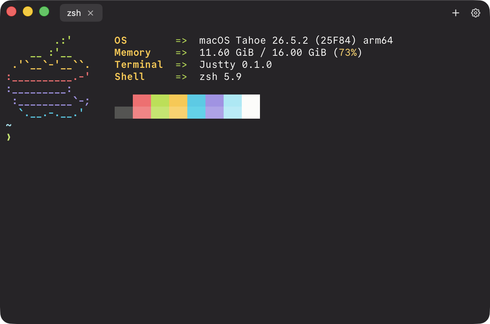

<p align="center">
  
</p>
<h1 align="center">JusTTY</h1>

<p align="center">
  
</p>

A simple native macOS terminal built with Swift and [libghostty](https://github.com/egoist-labs/libghostty-spm). It’s intentionally minimal - meant for quick commands, not as a full-time replacement for your main terminal.

## Features

- Real PTY shells via Ghostty’s Metal renderer
- Multi-window and tabs (⌘N / ⌘T / ⌘W, ⌘⇧[ / ⌘⇧])
- Color themes from the GhosttyTheme catalog
- Font family, size, weight, and line height
- Window padding, starting position, and character-grid size
- In-app keyboard shortcuts sheet (Settings)

Full list: [docs/FEATURES.md](docs/FEATURES.md).

## Install

1. Download `Justty-macos.zip` from the [latest release](https://github.com/0x96f/justty/releases/latest).
2. Unzip it - you should get `Justty.app`.
3. Move `Justty.app` somewhere lasting (for example `/Applications` or `~/Applications`).
4. Open it (see below if macOS blocks the first launch).

## Unsigned builds

Release builds are **not code-signed or notarized**. On first open, Gatekeeper may say the app “can’t be opened because it is from an unidentified developer.”

**Recommended:** right-click (or Control-click) `Justty.app` → **Open** → **Open** again in the dialog. You only need to do this once.

**Alternative** (clears the quarantine flag after download):

```bash
xattr -dr com.apple.quarantine /path/to/Justty.app
open /path/to/Justty.app
```

More help: [docs/TROUBLESHOOTING.md](docs/TROUBLESHOOTING.md).

## Requirements

- macOS 15.6+
- Xcode 16+ (with Swift 5 / macOS SDK) to build from source

## Build from source

```bash
git clone --recurse-submodules <your-repo-url> justty
cd justty
open justty.xcodeproj
```

If you already cloned without submodules:

```bash
git submodule update --init --recursive
```

Build and run the **justty** scheme. App sandbox is **off** so Ghostty can spawn a real shell (`.exec`).

If packages fail to resolve or shells won’t start, see [docs/TROUBLESHOOTING.md](docs/TROUBLESHOOTING.md).

## License

MIT
